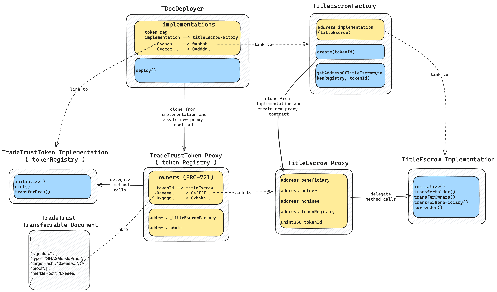
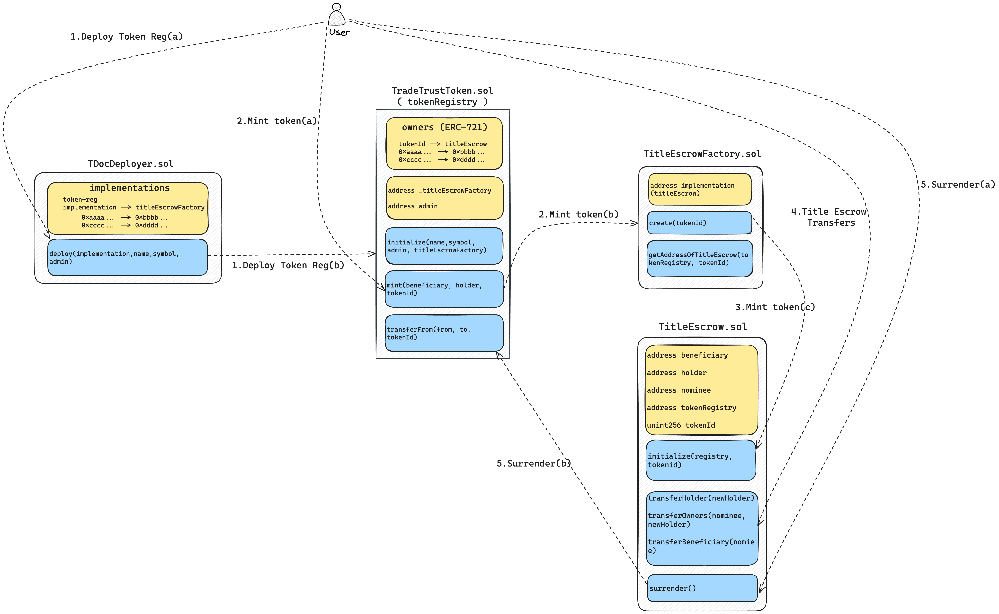

# ADR

Architectural Decision Records (ADRs) for TradeTrust

## Table of Content

| Proposal                               | Implementation |
| -------------------------------------- | -------------- |
| Identity Verifiable Credential (ID-VC) | TT v4 beta     |

## Smart Contract Architecture

This section contains the architecture documentation for our smart contracts. The documentation is divided into two main diagrams:

1. **Proxy Implementation and Data Structure Link**
2. **Sequence of Actions for Transferrable Records**

> [!NOTE]  
> For simplicity, some of the detailed complexity is hidden.

### Proxy Implementation and Data Structure Link Diagram

This diagram illustrates the proxy pattern implementation and the data structure linkage between the smart contracts. The proxy pattern allows for the separation of the contract's logic and its data storage, facilitating upgradability. The primary components include:

- **Proxy Contract**: Serves as the entry point for external calls, delegates calls to the implementation contract, and holds the state data.
- **Implementation Contract**: Contains the business logic and functionality of the smart contracts.

### Sequence of Actions for Transferrable Records Diagram

This diagram depicts the sequence of actions from the deployment of a new token registry to the minting and surrendering of tokens from a user's perspective. The key steps include:

1. **Deploy Token Registry**

   a. **User initiates the deployment**: The user starts deploying the token registry by executing the deploy method in `TDocDeployer.sol`.

   b. **Clone and initialize**: `TDocDeployer` clones the existing token registry implementation and initializes the new TradeTrust token registry along with the `TitleEscrowFactory`. For subsequent minting for that token registry, the `TitleEscrowFactory` will be responsible for generating new `TitleEscrow` contracts.

2. **Mint the Token**

   a. **User mints the token**: The user mints the token by providing the `tokenId`. The mint method of `TradeTrustToken` will be executed, which then calls the create method of its `TitleEscrowFactory`.

   b. **Create new TitleEscrow**: The create method of `TitleEscrowFactory` will be executed to create a new `TitleEscrow`. It will clone the existing `TitleEscrow` implementation and create a new `TitleEscrow` contract.

   c. **Initialize TitleEscrow**: The new `TitleEscrow` contract will be initialized. After creating the `TitleEscrow`, `TradeTrustToken` will update its owners' data structure, setting the `tokenId` as the key and the new `TitleEscrow` address as the value.

3. **TitleEscrow Transfers**

   After a new token is minted, the user can perform title transfers (e.g., change the holder) by interacting with the `TitleEscrow`.

4. **Surrender**

   a. **User executes surrender**: The user who is both the owner and the holder executes the surrender method of `TitleEscrow`.

   b. **Transfer and burn**: `TitleEscrow` will execute the parent token registry's transferFrom method for surrender. After accepting the surrender, it will execute the transferFrom method of `TradeTrustToken`, and eventually, the owner of the token will become the burned address.

